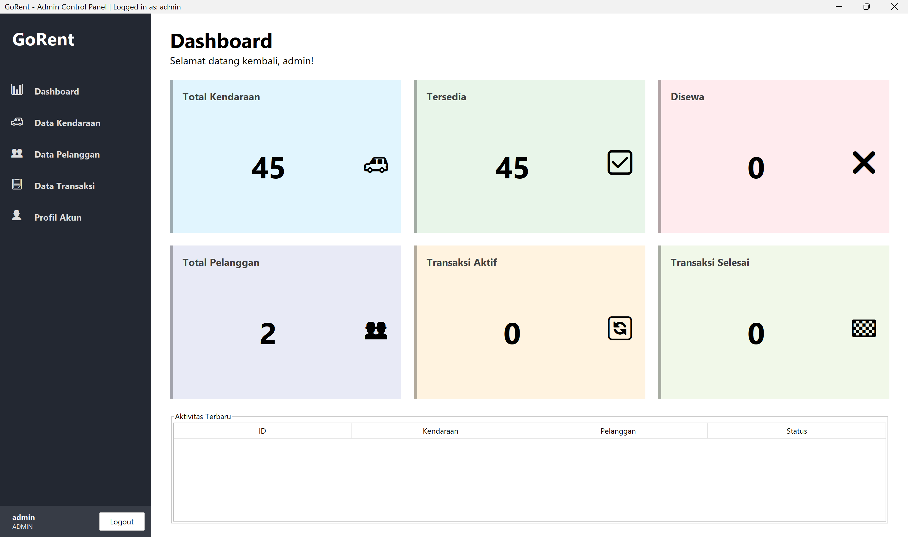
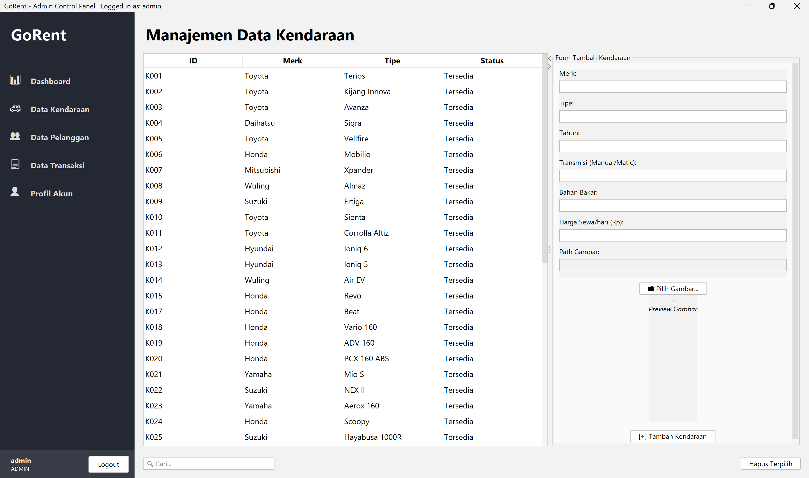
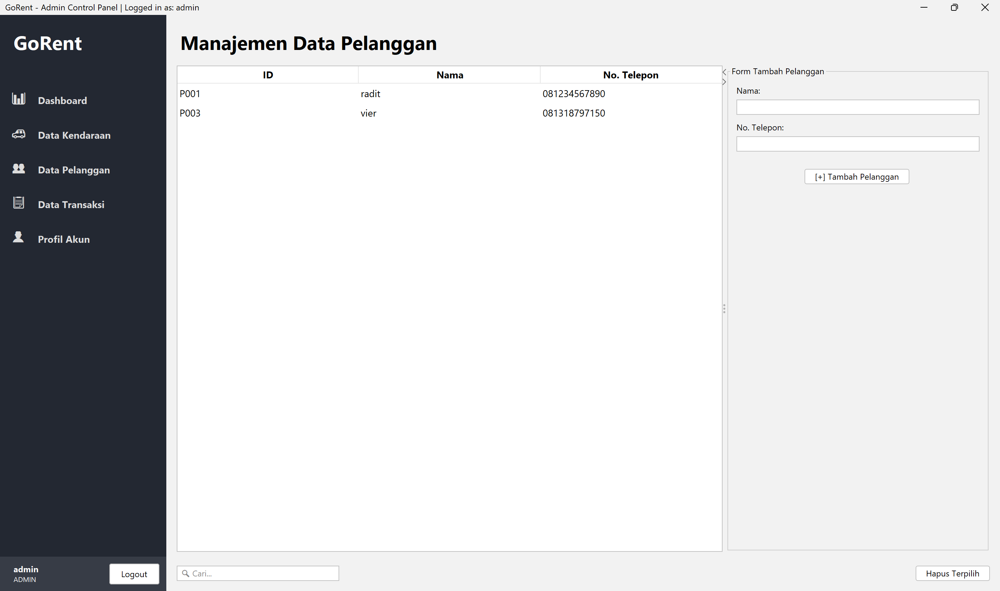
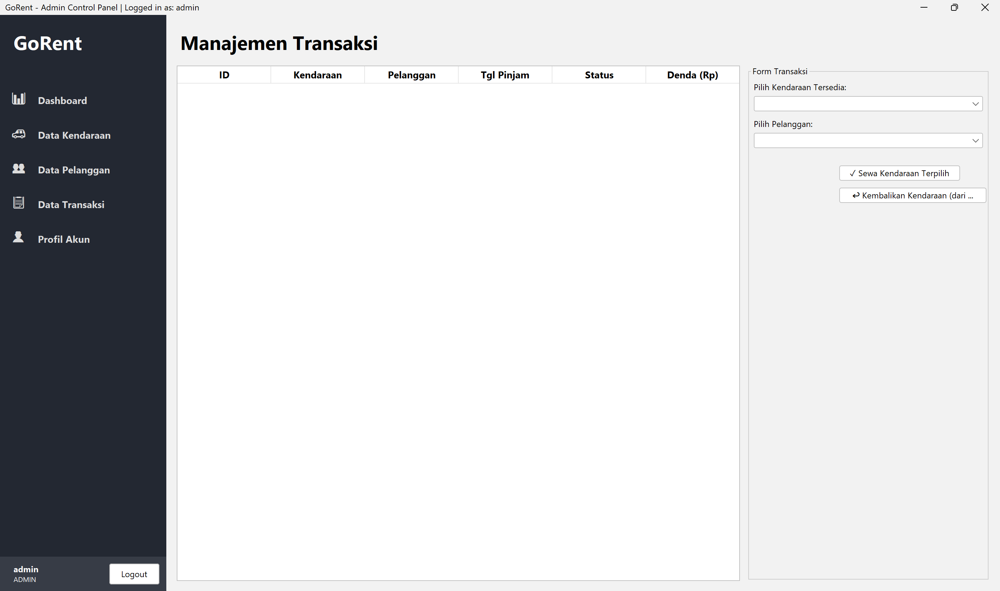
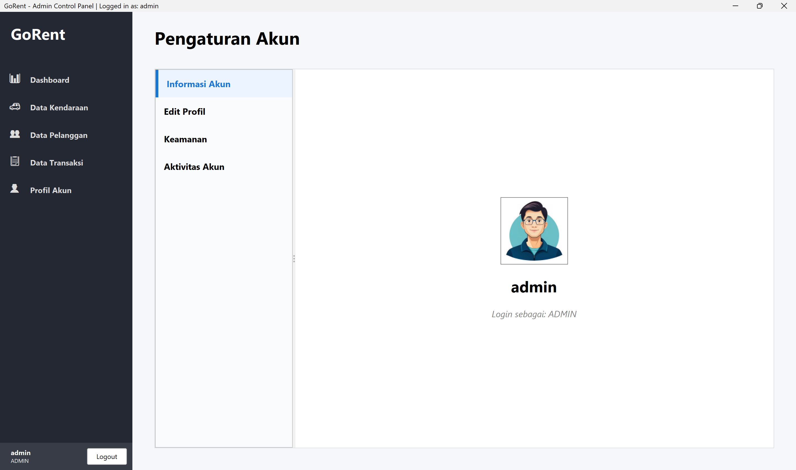
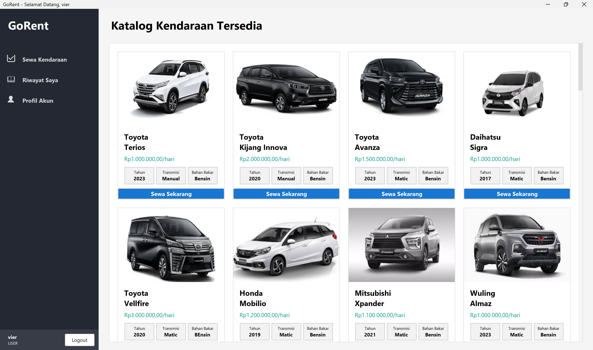
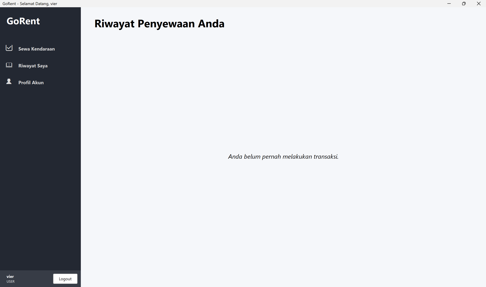
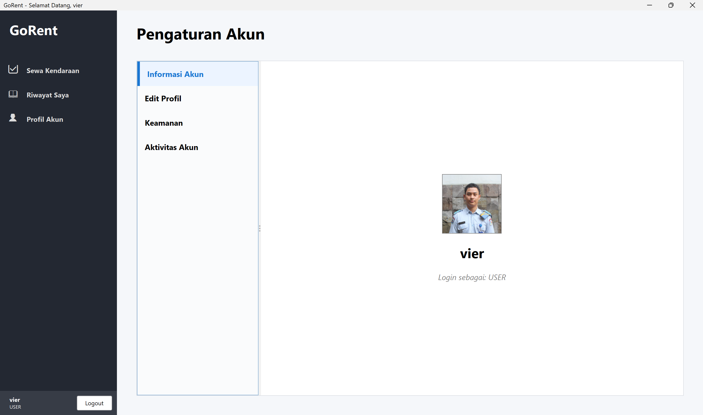

# GoRent - Vehicle Rental Management System

> A modern, role-based desktop application designed to streamline the operations of a vehicle rental business. Built with Java Swing and powered by a MySQL database, this project provides an intuitive dashboard for administrators to manage inventory and a clean, simple interface for customers to rent vehicles.

---

## 📖 About The Project

Managing a vehicle rental service involves handling complex data, from vehicle availability to customer transactions. **GoRent** aims to solve this by creating a centralized, user-friendly, and secure platform that connects administrators with customers. The project focuses on providing a seamless experience for both primary user roles: the customer looking to rent, and the administrator managing the business.

### View Admin






### View Customer




---

## ✨ Key Features

The platform's functionality is divided based on two primary user roles:

### For Users (Customers)
* **Secure Account Management**: Users can register for a new account, log in securely, and manage their profile details.
* **Vehicle Catalog**: Browse a clean, user-friendly catalog of all available vehicles with clear images, specifications, and pricing.
* **Simple Rental Process**: Rent a vehicle directly from the catalog with just a few clicks.
* **Rental History**: Easily track and view a personal history of all past and current rental transactions.
* **Advanced Profile Control**:
    * Update personal information and contact details.
    * Change account password for security.
    * Upload a custom profile picture.
    * View personal login history to monitor account activity.
    * Securely delete their own account and associated data.

### For Administrators
* **Comprehensive Dashboard**: A dedicated dashboard to get an at-a-glance overview of the business with key metrics like total vehicles, availability, active rentals, and customer count.
* **Full Vehicle Management (CRUD)**: Admins have full Create, Read, Update, and Delete capabilities for their vehicle inventory, including an image upload feature for each listing.
* **Customer Database Management**: View and manage all registered customer profiles.
* **Complete Transaction Oversight**: Monitor all transactions, process vehicle returns, and apply fines for late returns or damages.
* **Secure Access Control**: The admin panel is a protected area, ensuring that only authorized personnel can manage the business operations.

---

## 🛠️ Tech Stack

This project is built with a focus on creating a robust and modern desktop application.

* **Core Language**: Java
* **Desktop UI**:
    * Java Swing (for the Graphical User Interface)
    * FlatLaf (A modern, open-source Look and Feel for Swing applications)
* **Database**: MySQL
* **Connectivity**: MySQL Connector/J (JDBC driver for database communication)

---

## 🚀 Getting Started

To get a local copy up and running, follow these simple steps.

### Prerequisites
* Java Development Kit (JDK) 11 or newer.
* A local database server like XAMPP, WAMP, or a standalone MySQL installation.
* An IDE like IntelliJ IDEA, Eclipse, or VS Code with Java support.
* Git (optional, for cloning).

### Installation

1.  **Clone the repository**
    ```sh
    git clone [https://github.com/YOUR_USERNAME/GoRent.git](https://github.com/YOUR_USERNAME/GoRent.git)
    ```
    Alternatively, you can download the project as a ZIP file and extract it.

2.  **Database Setup**
    * Start the Apache and MySQL modules from your XAMPP Control Panel.
    * Open your browser and navigate to `http://localhost/phpmyadmin`.
    * Create a new database named `gorent`.
    * Select the `gorent` database and go to the **Import** tab.
    * Upload the `database_schema.sql` file (you should create this file by exporting your database structure) to automatically create all the required tables (`users`, `kendaraan`, `pelanggan`, `transaksi`, `login_history`).

3.  **Configure Connection**
    * Open the project in your IDE and navigate to the `src/DatabaseConnection.java` file.
    * Adjust the database credentials if they differ from the default XAMPP setup.
    ```java
    class DatabaseConnection {
        private static final String URL = "jdbc:mysql://localhost:3306/gorent";
        private static final String USER = "root"; // Change this if needed
        private static final String PASSWORD = ""; // Change this if your MySQL root user has a password

        // ... rest of the code
    }
    ```

4.  **Run the Project**
    * Locate and open the `src/Mainnn.java` file.
    * Run the `main` method from your IDE.
    * The application's login window is now live on your desktop!

---

## 📄 License

This project is open-source. Feel free to use and modify it as you see fit.

---
Created by Xavier Yubin Raditio
